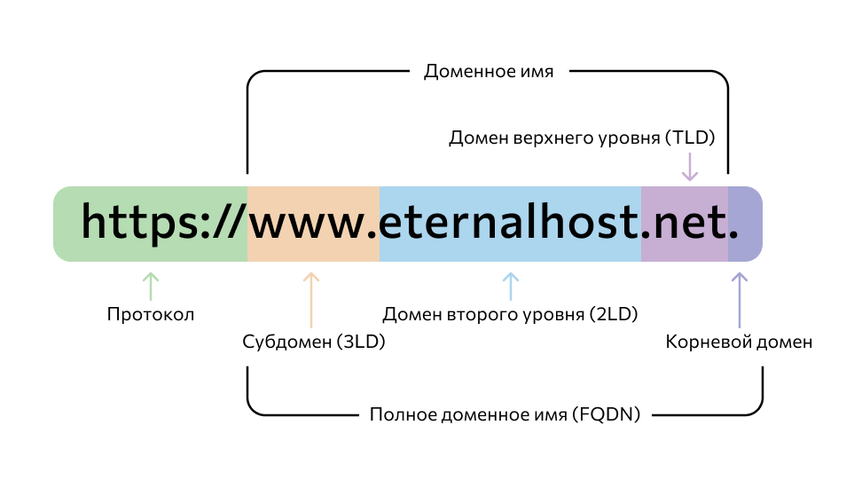
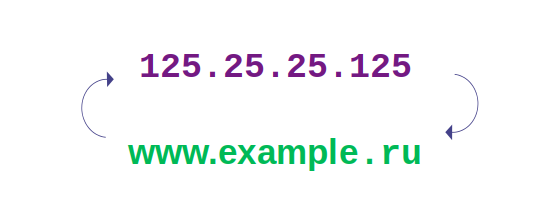
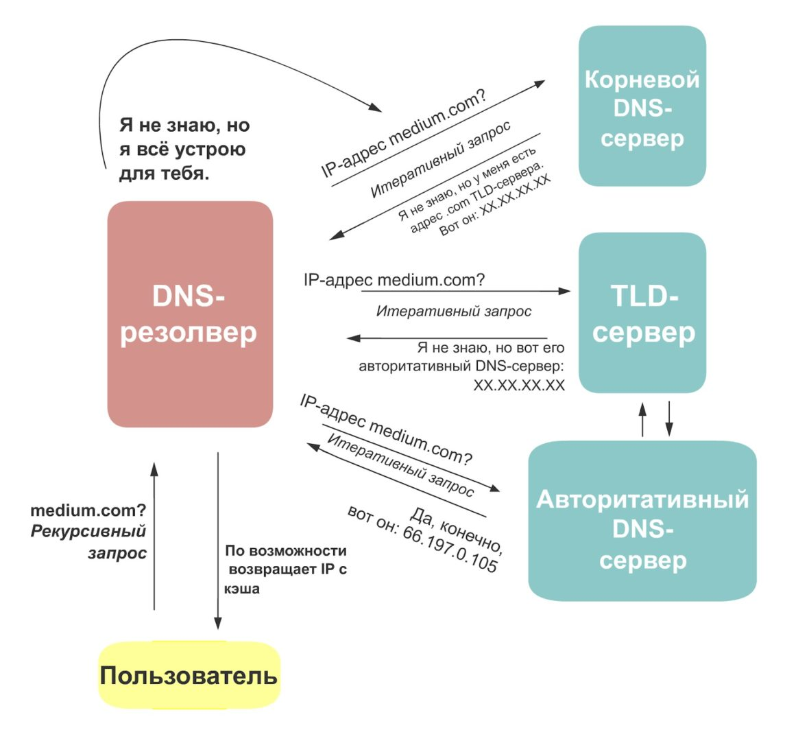
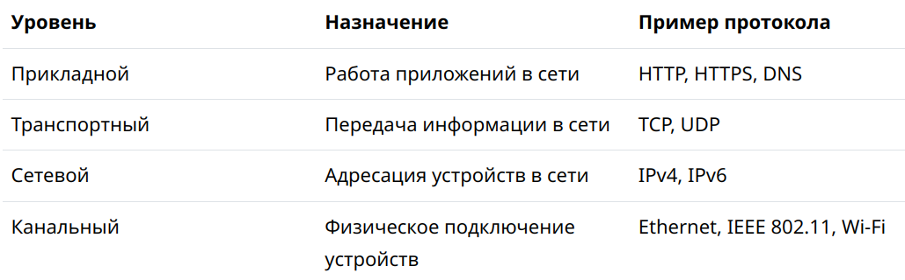
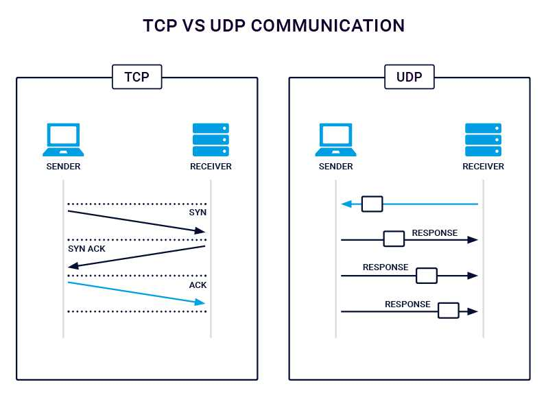
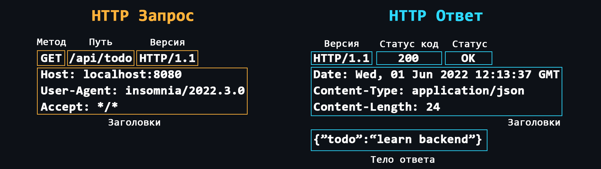

<a id="network"/></a>
`Сеть и интернет`
- [Что такое доменное имя](#что-такое-доменное-имя)
- [IP-адрес](#ip-адрес)
- [Файл hosts?](#файл-hosts)
- [Что такое DNS](#что-такое-dns)  
- [Cтек протоколов TCP/IP](#cтек-протоколов-tcpip)
- [TCP и UDP](#tcp-и-udp)
- [Протокол HTTP](#протокол-http)

***
### Что такое доменное имя

<p align="center"></p>

[Доменные имена](https://ru.wikipedia.org/wiki/%D0%94%D0%BE%D0%BC%D0%B5%D0%BD%D0%BD%D0%BE%D0%B5_%D0%B8%D0%BC%D1%8F) - это человеко-читаемые адреса веб-серверов, доступных в Интернете. Они состоят из частей (уровней) разделенных между собой точкой. Каждая из этих частей предоставляет специфическую информацию о доменном имени. Например страну, название сервиса, локализацию и т.д.

**Кто владеем доменными именами**
> Корпорация [ICANN](https://ru.wikipedia.org/wiki/ICANN) является основателем распределённой системы регистрации доменов. Она выдаёт аккредитации компаниям, которые хотят заниматься продажей доменов. Таким образом формируется конкурентный доменный рынок.

**Как купить доменное имя**
> Доменное имя нельзя купить навсегда. Оно выдается в аренду на определенный срок. Покупать домены лучше у [аккредитованных регистраторов](https://www.icann.org/en/accredited-registrars?filter-letter=a&sort-direction=asc&sort-param=name&page=1) (найти их можно почти в любой стране).

<details>
<summary>🔗 <b>Ссылки на материалы</b></summary>

1. 📄 [**Что такое доменные имена** – MDN](https://developer.mozilla.org/ru/docs/Learn/Common_questions/What_is_a_domain_name)
2. 📄 [**Доменное имя в призме закона** – habr](https://habr.com/ru/post/557786/)
</details>

[⬆️ Содержание](#network)

***

### IP-адрес

<p align="center"></p>

[IP-адрес](https://ru.wikipedia.org/wiki/IP-%D0%B0%D0%B4%D1%80%D0%B5%D1%81) – уникальный числовой адрес, который используется для распознавания того или иного устройства в сети.

**Уровни видимости**
> - Внешний и доступный всем IP-адрес, который принадлежит Вашему провайдеру и используется для выхода в интернет сотен других пользователей.
> - IP-адрес вашего роутера в локальной сети провайдера, той самой, с IP-адресом которой вы выходите в интернет.
> - IP-адрес вашего компьютера в локальной (домашней) сети, созданной роутером, к которой вы можете подключать свои устройства. Как правило, имеет вид 192.168.XXX.XXX.
> - Внутренний IP-адрес компьютера, недоступный извне и используемый только для общения между запущенными процессами. У всех он одинаковый – 127.0.0.1 или просто localhost.

**[Порт](https://ru.wikipedia.org/wiki/%D0%9F%D0%BE%D1%80%D1%82_(%D0%BA%D0%BE%D0%BC%D0%BF%D1%8C%D1%8E%D1%82%D0%B5%D1%80%D0%BD%D1%8B%D0%B5_%D1%81%D0%B5%D1%82%D0%B8))**   
На одном устройстве (компьютере) может работать множество приложений, которые используют сеть. Для того, чтобы правильно распознать, куда и какие данные, пришедшие по сети, нужно доставить (в какое из приложений), используется специальный числовой номер – порт.

**[IPv4](https://ru.wikipedia.org/wiki/IPv4)**  
- IPv4 формируется из четырех блоков и записывается в формате десятичной системы счисления — используются цифры от нуля до девяти — например, `172.32.110.14`. Это дает чуть более четырех миллиардов уникальных адресов
- Из доступных `4 миллиардов` адресов несколько десятков миллионов зарезервированы под частные сети
- IPv4 почти исчерпал список доступных адресов, потому что количество устройств с каждым годом становится больше. Чтобы экономить адреса, провайдеры используют схемы с серыми IP. Они подключают сотни пользователей к одному глобальному адресу

**[IPv6](https://ru.wikipedia.org/wiki/IPv6)**  
- стандарт IPv6 позволяет подключить более `340 ундециллионов` пользователей. Он формируется из восьми блоков и записывается в шестнадцатеричной системе счисления — цифры от нуля до девяти и буквы a, b, c, d, e, f. Например, `a391:5008:1081:a567:b:863e:5543:b2cc`.

<details>
    <summary>🔗 <b>Ссылки на материалы</b></summary>

1. 📄 [**Компьютерные адреса** – hexlet](https://ru.hexlet.io/courses/internet-fundamentals/lessons/computer-addresses/theory_unit)
2. 📺 [**Адреса IPv6 | Компьютерные сети. Продвинутые темы** – YouTube](https://youtu.be/KRAKAAJTxTg)

</details>

[⬆️ Содержание](#network)

***
### Файл hosts

[hosts](https://ru.wikipedia.org/wiki/Hosts) - это текстовый файл, который используется операционной системой для выполнения простого маппинга IP-адресов на доменные имена. Запрос к этому файлу имеет приоритет перед обращением к DNS-серверам. В отличие от системы DNS, содержимое файла задаётся администратором компьютера.

```
# Адрес для обращения компьютера к себе
127.0.0.1      localhost

# Адреса компьютеров в сети
120.1.200.2    PC-JavaScript
97.250.32.12   PC-Ruby
32.42.10.1     PC-DEV
```

**Зачем нужен файл hosts**
1. **Локальное разрешение имен:** Когда компьютер пытается найти IP-адрес для какого-то доменного имени, он сначала проверяет файл `hosts`. Если там есть необходимая запись, он использует её, что может быть полезно для быстрого разрешения доменов без обращения к DNS.

2. **Использование в локальных сетях:** В небольших локальных сетях можно использовать `hosts`, чтобы настроить имена устройств вместо использования DNS-серверов.
3. **Перенаправление доменов**: Например, чтобы перенаправить example.com на 192.168.1.1, нужно просто добавь в файл hosts: `192.168.1.1 example.com`. Большое количество вредоносных программ используют файл hosts для блокирования доступа к веб-сайтам популярных порталов или перенаправляют пользователя на страницы, внешне похожие на популярные ресурсы.
4. **Блокировка ресурсов**: С помощью файла `hosts` возможно осуществлять фильтрацию рекламы путём перенаправления доменных адресов баннеров на адрес 127.0.0.0, 127.0.0.1 (локальный хост) или 0.0.0.0 (рекомендуется).

[⬆️ Содержание](#network)

***

### Что такое DNS

<p align="center"></p>

[DNS (Domain Name System)](https://ru.wikipedia.org/wiki/DNS) - это децентрализованная система именования адресов в Интернете, которая позволяет создавать удобные для человека буквенные наименования (доменные имена) соответствующие числовым `IP-адресам`, которые используются компьютерами.

**Структура DNS**  
> DNS состоит из множества независимых узлов, каждый из которых хранит только те данные, которые входят в его зону ответственности.

**DNS Resolver**
> Сервер, который расположен в непосредственной близости от вашего провайдера. Именно он выполняет поиск адресов по доменным именам, а также занимается их кэшированием (временным хранением для быстрой выдачи при последующих обращениях).

<p align="center"></p>

**DNS записи**
> - Запись A – связывает доменное имя с адресом IPv4.
> - Запись AAAA – связывает доменное имя с адресом IPv6.
> - Запись CNAME – перенаправляет на другое доменное имя.
> - и другие – запись MX, запись NS, запись PTR, запись SOA.

<details>
<summary>🔗 <b>Ссылки на материалы</b></summary>

1. 📄 [**Что такое DNS-сервер простыми словами** – hexlet](https://guides.hexlet.io/ru/dns/)
2. 📺 [**Система доменных имен DNS** — YouTube](https://www.youtube.com/watch?v=B0J0c0KLtbQ&ab_channel=AndreySozykin)
3. 📄 [**Давайте уже разберемся в DNS** – habr](https://habr.com/ru/post/303446/)
4. 📄 [**Как это работает: Пара слов о DNS** – habr](https://habr.com/ru/company/1cloud/blog/309018/)
</details>

[⬆️ Содержание](#network)

***

### Cтек протоколов TCP/IP

<p align="center"></p>

[Cтек TCP/IP](https://ru.wikipedia.org/wiki/TCP/IP) — набор правил, которые описывают, как компьютеры соединяются и передают информацию друг другу. Наименование модели состоит из названий двух главных протоколов: `TCP` — протокол, который описывает, как передается информация внутри сети; `IP` — протокол, который описывает связь компьютеров друг с другом.

Сетевая модель делится на 4 уровня, в каждом из которых применяются протоколы для работы той или иной функции:

- **Канальный уровень** или Link Layer — самый низкий уровень. На этом уровне описываются протоколы, которые обеспечивают связь компьютеров в сети, обработка данных устройствами. Проводное, спутниковое, беспроводное соединения, сетевые карты и свитчи — все это относится к канальному уровню
- **Сетевой уровень** или Network Layer — протоколы для взаимодействия сетей между собой. В модели TCP/IP на этом уровне используется протокол [IP](https://ru.wikipedia.org/wiki/Internet_Protocol).
- **Транспортный уровень** или Transport Layer — протоколы для передачи информации. При этом используются такие протоколы, как [TCP](https://ru.wikipedia.org/wiki/Transmission_Control_Protocol) - надежный, но медленный и [UDP](https://ru.wikipedia.org/wiki/User_Datagram_Protocol) - быстрый, но ненадежный.
- **Прикладной уровень** или Application Layer — протоколы для связи сетевых приложений. Эти протоколы позволяют открывать сайты, смотреть онлайн-фильмы. Протоколы: [HTTP](#протокол-http), [FTP](https://ru.wikipedia.org/wiki/File_Transfer_Protocol), [SMTP](https://ru.wikipedia.org/wiki/Simple_Mail_Transfer_Protocol), [DNS](https://ru.wikipedia.org/wiki/Domain_Name_System), [SNMP](https://ru.wikipedia.org/wiki/Simple_Network_Management_Protocol).

<details>
<summary>🔗 <b>Ссылки на материалы</b></summary>

1. 📄 [**Руководство по стеку протоколов TCP/IP для начинающих** – selectel.ru](https://selectel.ru/blog/tcp-ip-for-beginners/)
2. 📺 [**Модель и стек протоколов TCP/IP** — YouTube](https://youtu.be/UZo4ffQ-aAc)
</details>

[⬆️ Содержание](#network)

***

### TCP и UDP

<p align="center"></p>

[TCP](https://ru.wikipedia.org/wiki/Transmission_Control_Protocol) (Transmission Control Protocol) - протокол, обеспечивающий надежную передачу данных. Гарантирует доставку пакетов и контролирует ее. Информация передается только в том случае, если между компьютерами устанавливается связь и подтверждается готовность к передаче/приему. Это сказывается на скорости передачи.  
Данный протокол используется там, где потеря информации недопустима.
> - **Веб-приложения**: Передача веб-страниц, файлов, изображений и других ресурсов через HTTP и HTTPS.
> - **Электронная почта**: Протокол SMTP (Simple Mail Transfer Protocol) для отправки электронной почты и протоколы POP3/IMAP для получения почты.
> - **Файловые передачи**: FTP (File Transfer Protocol) - протокол для передачи файлов. 

[UDP](https://ru.wikipedia.org/wiki/UDP) (User Datagram Protocol) – простой протокол с быстрой передачей данных. Пакеты пересылаются, но не проверяются. Информация пересылается быстрее, так как нет дополнительных проверок, но возможны потери.
> - **Стриминг мультимедиа**: Потоковая передача аудио и видео, такие как VoIP, IPTV и онлайн игры.
> - **DNS**: UDP широко применяется для запросов DNS, где быстрые ответы важны, даже если это означает потерю части пакетов.

<details>
<summary>🔗 <b>Ссылки на материалы</b></summary>

1. 📄 [**Протоколы TCP и UDP** – doka.guide](https://doka.guide/tools/tcp-udp-protocols/)
2. 📄 [**Транспортный уровень** – hexlet](https://ru.hexlet.io/courses/internet-fundamentals/lessons/tcp-ip/theory_unit)
3. 📺 [**Протокол TCP | Курс "Компьютерные сети"** — YouTube](https://www.youtube.com/watch?v=CKUOb4htnB4)
4. 📺 [**Протокол UDP | Курс "Компьютерные сети"** — YouTube](https://www.youtube.com/watch?v=GBrLfZvRrd8)
</details>

[⬆️ Содержание](#network)

***

### Протокол HTTP

[HTTP (HyperText Transport Protocol)](https://ru.wikipedia.org/wiki/HTTP) - cамый важный протокол интернета. Используется для передачи данных любого формата. Сам по себе протокол работает по простому принципу: запрос –> ответ. По умолчанию для коммуникации по HTTP используется порт `80`.

[Структура HTTP-сообщений](https://developer.mozilla.org/ru/docs/Web/HTTP/Messages#%D0%B7%D0%B0%D0%BF%D1%80%D0%BE%D1%81%D1%8B_http)
        > HTTP-сообщения состоят из заголовка, содержащего метаданные о сообщении, за которым следует необязательное тело сообщения, содержащее отправляемые данные.

<p align="center"></p>

[Заголовки](https://developer.mozilla.org/ru/docs/Web/HTTP/Headers)  
> Дополнительная служебная информация которая отправляется вместе с запросом/ответом. <br>
> Основные: [Host](https://developer.mozilla.org/ru/docs/Web/HTTP/Headers/Host), [User-Agent](https://developer.mozilla.org/ru/docs/Web/HTTP/Headers/User-Agent), [If-Modified-Since](https://developer.mozilla.org/ru/docs/Web/HTTP/Headers/If-Modified-Since), [Cookie](https://ru.wikipedia.org/wiki/Cookie), [Referer](https://developer.mozilla.org/ru/docs/Web/HTTP/Headers/Referer), [Authorization](https://developer.mozilla.org/ru/docs/Web/HTTP/Headers/Authorization), [Cache-Control](https://developer.mozilla.org/ru/docs/Web/HTTP/Headers/Cache-Control), [ETag](https://developer.mozilla.org/ru/docs/Web/HTTP/Headers/ETag), [Accept](https://developer.mozilla.org/ru/docs/Web/HTTP/Headers/Accept), [Content-Type](https://developer.mozilla.org/en-US/docs/Web/HTTP/Headers/Content-Type), [Content-Length](https://developer.mozilla.org/ru/docs/Web/HTTP/Headers/Content-Length), [Last-Modified](https://developer.mozilla.org/ru/docs/Web/HTTP/Headers/Last-Modified), [Set-Cookie](https://developer.mozilla.org/ru/docs/Web/HTTP/Headers/Set-Cookie), [Content-Encoding](https://developer.mozilla.org/ru/docs/Web/HTTP/Headers/Content-Encoding).  

[Методы запросов](https://developer.mozilla.org/ru/docs/Web/HTTP/Methods)
> Основные: [GET](https://developer.mozilla.org/ru/docs/Web/HTTP/Methods/GET), [POST](https://developer.mozilla.org/ru/docs/Web/HTTP/Methods/POST), [PUT](https://developer.mozilla.org/ru/docs/Web/HTTP/Methods/PUT), [DELETE](https://developer.mozilla.org/en-US/docs/Web/HTTP/Methods/DELETE).  
> Дополнительные: [HEAD](https://developer.mozilla.org/en-US/docs/Web/HTTP/Methods/HEAD), [CONNECT](https://developer.mozilla.org/en-US/docs/Web/HTTP/Methods/CONNECT), [OPTIONS](https://developer.mozilla.org/ru/docs/Web/HTTP/Methods/OPTIONS), [TRACE](https://developer.mozilla.org/en-US/docs/Web/HTTP/Methods/TRACE), [PATCH](https://developer.mozilla.org/en-US/docs/Web/HTTP/Methods/PATCH).  

[Коды состояния](https://developer.mozilla.org/ru/docs/Web/HTTP/Status)
> Каждый ответ от сервера имеет специальный числовой код, который характеризует состояние отправленного запроса. Эти коды делятся на 5 основных классов:
> -   **1хх** - Служебная информация
> -   **2хх** - Успешный запрос
> -   **3хх** - Перенаправление на другой адрес
> -   **4хх** - Ошибка на стороне клиента
> -   **5хх** - Ошибка на стороне сервера

[HTTPS](https://ru.wikipedia.org/wiki/HTTPS)
> Тот же HTTP, но с поддержкой шифрования. Ваши приложения должны использовать HTTPS, чтобы быть безопасными. Данный протокол по умолчанию использует порт `443`.  

[Cookie](https://developer.mozilla.org/ru/docs/Web/HTTP/Cookies)
> Протокол HTTP не предоставляет возможности сохранять информацию о состояниях предыдущих запросов и ответов. Для решения этой проблемы используются куки. Куки позволяют серверу хранить информацию на стороне клиента, которую клиент может передавать обратно на сервер. Например, куки могут использоваться для авторизации пользователей или для сохранения различных параметров и настроек.

[CORS (Cross origin resource sharing)](https://ru.wikipedia.org/wiki/Cross-origin_resource_sharing)
> Технология, которая позволяет одному домену получать данные от другого.

[CSP (Content Security Policy)](https://developer.mozilla.org/ru/docs/Web/HTTP/CSP)
> Специальный заголовок позволяющий распознавать и устранять определённые типы уязвимостей веб-приложения.

[Эволюция HTTP](https://runebook.dev/ru/docs/http/basics_of_http/evolution_of_http)
> - **HTTP 1.0**: Использует отдельные соединения для каждого запроса/ответа, не поддерживает кэширование, передача сообщений в виде plain текста.
> - **HTTP 1.1**: Возможность переиспользовать одно соеднинение, конвейеризация, заголовок Host и кодирование передачи данных в виде чанков (кусков).
> - **HTTP 2**: Поддерживает мультиплексирование, сжатие заголовков, пуш-уведомления и работу с двоичными данными.
> - **HTTP 3**: Построен поверх [протокола QUIC](https://ru.wikipedia.org/wiki/QUIC), предлагает улучшенное мультиплексирование, стабильность и лучшую производительность в ненадежных сетях.

<details>
    <summary>🔗 <b>Ссылки на материалы</b></summary>

1. 📄 [**Протокол HTTP** – MDN (mozilla.org)](https://developer.mozilla.org/ru/docs/Web/HTTP)
2. 📺 [**Протокол HTTP | Курс компьютерные сети** – YouTube](https://youtu.be/RlccXUx4LVw)
3. 📄 [**HTTP-запросы: структура, методы, строка статуса и коды состояния** – selectel.ru](https://selectel.ru/blog/http-request/)
4. 📄 [**Что такое протокол HTTPS, и как он защищает вас в интернете**](https://guides.hexlet.io/ru/https-yandex-guide/)
5. 📄 [**В чем разница протоколов HTTP и HTTPS** – selectel.ru](https://selectel.ru/blog/http-https/)
6. 📺 [**Как работает HTTPS?** – YouTube](https://youtu.be/B3j4SS5P8tM)
7. 📺 [**Что такое cookies браузера** – YouTube](https://youtu.be/Ri3IAb6tdlE)
8. 📄 [**Что такое cookie в браузере и почему на многих сайтах предупреждают об их использовании?**](https://club.dns-shop.ru/blog/t-326-internet/47805-chto-takoe-cookie-v-brauzere-i-pochemu-na-mnogih-saitah-preduprejd)
9. 📄 [**CORS для чайников: история возникновения, как устроен и оптимальные методы работы** – habr.com](https://habr.com/ru/company/macloud/blog/553826/)
10. 📄 [**Улучшение сетевой безопасности с помощью Content Security Policy** – habr.com](https://habr.com/ru/company/nix/blog/271575/?)
11. 📄 [**Путь к HTTP/2** – habr.com](https://habr.com/ru/post/308846/)
12. 📄 [**Evolution of HTTP** – MDN (mozilla.org)](https://developer.mozilla.org/ru/docs/Web/HTTP/Basics_of_HTTP/Evolution_of_HTTP)
</details>

[⬆️ Содержание](#network)
